# Student-AI ... Machine Learning Project

Find it on GitHub: <a href="https://github.com/A-Hoenig/student-AI">Student-AI</a>

## Built With
[GitPod](https://www.gitpod.io/) 
[Jupyter Notebooks](https://jupyter.org/) 
[Streamlit](https://streamlit.io/) 
[Heroku](https://heroku.com)

## Introduction
This project is built using python data science libraries embedded using jupyter notebooks.
Jupyter notebooks are essentially a combination of a readme like this, but with embedded python code
that can run natively inside cells.

**For detailed information, navigate to the jupyter_notebooks folder on the left, to view the project as it was built**. The notebooks are in chronological order and take the reader through the data analysis steps to eventually create a machine learning model that can make a prediction. The use of random-state parameter means that, given the same input dataset, all steps are verifiable and can be recreated, achieving exactly the same result as in this project.

To make the project accessible to 'normal' users, the data is linked to a STREAMLIT dashboard that presents the result in a user friendly and interactive way. The interface also allows direct input to the prediction model and is the simulated final product that would be handed to a customer. (another, not implemented, solution would be an API).

The working project is deployed on Heroku [HERE](https://student-ai-f1a195bb5d91.herokuapp.com/)

## Dataset Content
The dataset provided is a list of fictitious student performance data from an unnamed college. The dataset can be found here:
https://www.kaggle.com/datasets/desalegngeb/students-exam-scores

The source offers 2 versions of the dataset, a smaller one with complete data and fewer features, and a larger one with fewer datarows, but more available features. This larger dataset also has the additional requirement of some data cleaning as some values are missing, and need to be corrected for.

For the purpose of this project, I will use the second set to demonstrate some data cleaning that might be required before the exploratory data analysis and model training.

Available features are:

* **Gender:** Gender of the student (male/female)
* **EthnicGroup:** Ethnic group of the student (group A to E)
* **ParentEduc:** Parent(s) education background (from some_highschool to master's degree)
* **LunchType:** School lunch type (standard or free/reduced)
* **TestPrep:** Test preparation course followed (completed or none)
* **ParentMaritalStatus:** Parent(s) marital status (married/single/widowed/divorced)
* **PracticeSport:** How often the student parctice sport (never/sometimes/regularly)
* **IsFirstChild:** If the child is first child in the family or not (yes/no)
* **NrSiblings:** Number of siblings the student has (0 to 7)
* **TransportMeans:** Means of transport to school (schoolbus/private)
* **WklyStudyHours:** Weekly self-study hours(less that 5hrs; between 5 and 10hrs; more than 10hrs)
* **MathScore:** math test score(0-100)
* **ReadingScore:** reading test score(0-100)
* **WritingScore:** writing test score(0-100)

The target(s) will be the predicted score for Math, Reading and Writing for a given student.

## Business Requirements

The following metrics were decided with the stakeholder (school administration) that is looking to incorporate ML capability in supporting their counselling staff to monitor and help students achieve the academic standard.

### Purpose:
The primary objective is to create an interactive, user-friendly dashboard for school counselors and educators. This tool aims to predict student performance in math, reading, and writing, focusing on identifying students at risk of not achieving a passing grade. The dashboard will facilitate early intervention and personalized support strategies. The dashboard should be deployed to their internal server and allow counsellors secure access to the database and prediction model so they can prepapre for student counselling sessions.

## User stories
  
*template:* 
As a **'Role'**, I can **'Capability'**, so that **'Receive benefit'**

|As a...|I can ...|so that ...|
|:---|:---|:---|
|Counsellor|open the dashboard|I can view the ML project|
|Counsellor|view the dataset|I can see what the original data looks like|
|Counsellor|click the nav buttons|I can select the different project pages|
|Counsellor|select radio buttons|I can choose the exam type to display|
|Counsellor|select student variables on the predict page|the model will make a prediction|
|Counsellor|upload a student csv file|I can get a generated report of all prediction results|
|Counsellor|view the conclusion page|I can see what to expect from the ML predictions|
|Data Practitioner|view the ML details page|I can get deep insight into how the models were generated|
|Data Practitioner|view the cleaner dataset|I can gain insight into data imputing and feature engineering|

## Hypothesis

I hypothesize that most of the listed features in the available student dataset will have some degree of influence on the overall performance of the student.

### Gender: Gender of the student (male/female)
depending on the subject, gender will probably influence the students overall performance.
### EthnicGroup: Ethnic group of the student (group A to E)
ethnicity (when regarded in socio-economic terms) will influence student perfromance. In this case the specfic groups are anonymized.
### ParentEduc: Parent(s) education background (from some_highschool to master's degree)
Parental education will influence student performance as I hypothesize that higher educated individuals will also prioritize the education of their children.
### LunchType: School lunch type (standard or free/reduced)
similar to ehtnicity, the availability of a healthy regular meal will most likely influence performance directly by affecting concentration, but also indirectly as a factor of other socio-economic variables such as financial security enabling additional schooling support (materials, study partners etc)
### TestPrep: Test preparation course followed (completed or none)
Availability and participation in test prep courses most likely will influence test performance for most students
### ParentMaritalStatus: Parent(s) marital status (married/single/widowed/divorced)
parental status might influence students performance on a motivationl level as well as more basic factors such as avaiable study time and less distractions
### PracticeSport: How often the student parctice sport (never/sometimes/regularly))
Presumably regular sport will also help with concentration and brain development, leading to better academic performance
### IsFirstChild: If the child is first child in the family or not (yes/no)
First children tend to have more focussed attention from their parents and might possibly have a better start in their education path
### NrSiblings: Number of siblings the student has (0 to 7)
more youngers siblings might negatively impact performance due to distrctions and additional chores. Older siblings might help however in providing additional help in school studies. I hypothesize that this will not be an obvious lindicator of student performance.
### TransportMeans: Means of transport to school (schoolbus/private)
transportation will presumanbly have some influence again in socio-economic terms (private transport might equate to access to othr extracurricular activites that might help student performance)
### WklyStudyHours: Weekly self-study hours(less that 5hrs; between 5 and 10hrs; more than 10hrs)
I hypothesize that the mount of study time per week devoted to exam preparation will have a significant impact on student performance.

## The rationale to map the business requirements to the Data Visualizations and ML tasks
* The dataset with final results for Math, Reading and Writing will allow an EDA to identify which features of the data set have the most influence on the student performance.  This will allow a reasonable assessment of the evaluation of my hypothesies and corrobrate the schools assumptions so far. 

* The new step and direect business requirement will be to train a machine learning algorithm to predict the final score on a new class of students on unseen data. To achieve this, some feature enineering might be neccessary to encode categorical varibles into numerical values which can be interpreted by an ML pipleine. The initial approach will be supervised learning on known student results while allowing the algorithm to identify the key features that have the most influence on the result.

* To satisfy the business requirement, we aim to train the model to have a greater than 0.6 accuracy in predicting the scores for math, reading and writing.

## ML Business Case
* ML will help in identifying key features of the data that significantly impact the final scores of a given student. Armed with this knowledge, ML gives the unique capability to predict the probable student outcome and allow early intervention to ensure good student performance throught the school year.

## Dashboard Design
* The dashboard will analyze and display student data, including math, reading, and writing scores.
* It will incorporate various student features such as gender, weekly study hours, lunch type, parental status, and parental education levels.
* The tool will predict individual student scores based on entered data, using machine learning algorithms.
* It will flag students who are likely to struggle in achieving passing grades, enabling timely intervention.
* The dashboard will generate reports listing students who may require additional support or resources.

### Dashboard Mockups
Since the project will use a Streamlit Dashboard, the design is relatively limited. It is essentially a menu on the left allowing selection of individual pages. The main page to the right can contain mutlimedia in the form of charts, dataframes, text, info boxes as well as buttons, sliders etc. Due to this limitation, the design choices were relatively simple. For this project the choices were:

- Information Only
- Interactive Page for select or manipulate data
- Model interaction for data input and prediction (button, file upload)

the basic layout will be like this:

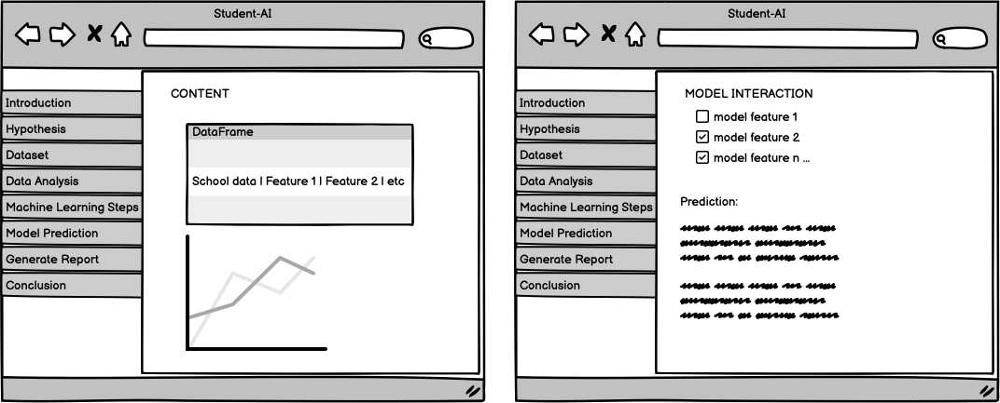

### Dashboard Pages:

#### INTRO
- **Introduction** - An introduction to the business requirement, the initial development strategy and an ethical assessment.
- **Project Hypotheses** - presentation of the project hypostheses.

#### DATA ANALYSIS
- **Data Intro / Cleaning** - Basic introdcution to the data set and initial steps of data cleaning.
- **Data Analysis** In depth analysis of each dataset feature and variables. Interactive buttons are incorporated to allow the user to explore in their own interest and ensure they are not 'bombarded' with data.
- **Machine Learning Deatils** - A more in depth look at the technical aspectes of feature enginerring, model piple selection and model training and testing. This page is for the datapractitioners in the organization that have some more in depth knowledge of the process.

#### Prediction
- **Generate Report** - Page that allows the counsellor to upload a cvs  list of new students and generate a report. The report list the ML predictions for each student.
- **Predict Student Results** Summary page for education experts interested in the model training steps and performance levels.

#### Conclusion
- **Conclusion** - Recap the project and identify issues with the model and assess the validity of the made hypotheses.

### Dashboard Screenshots

The final implementation is shown below:

#### Page 1 - Introduction
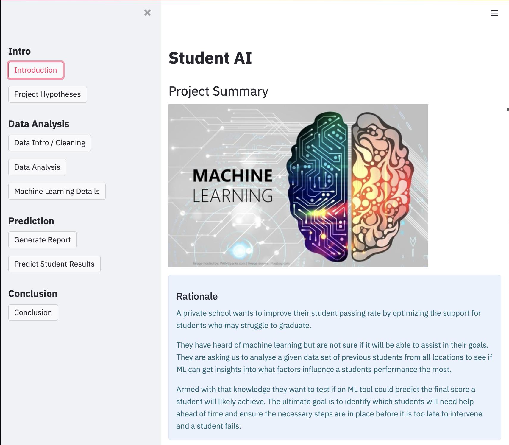

#### Page 2 - Hypotheses
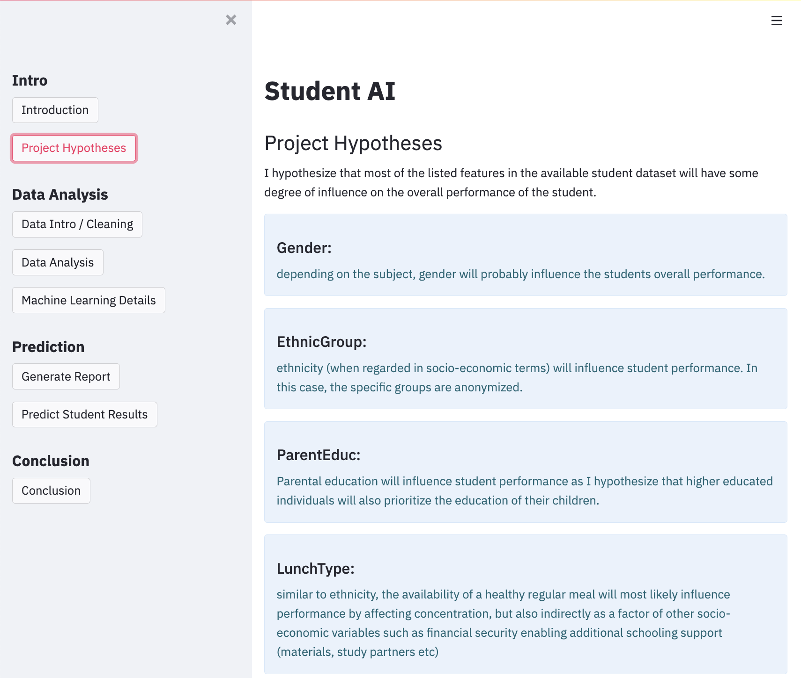

#### Page 3 - Dataset Introduction
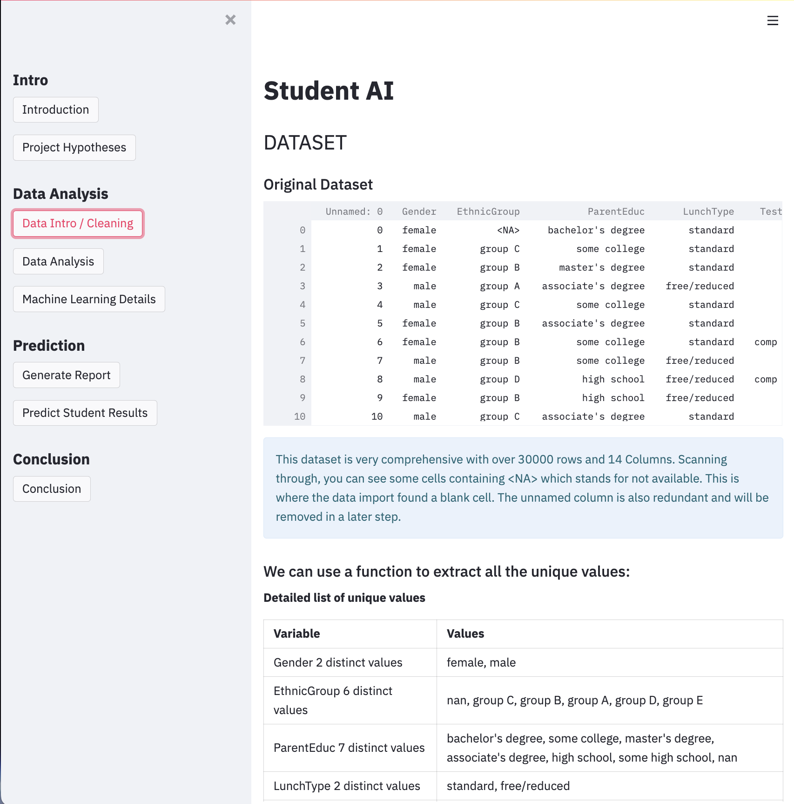

#### Page 4 - Detailed Data Analysis
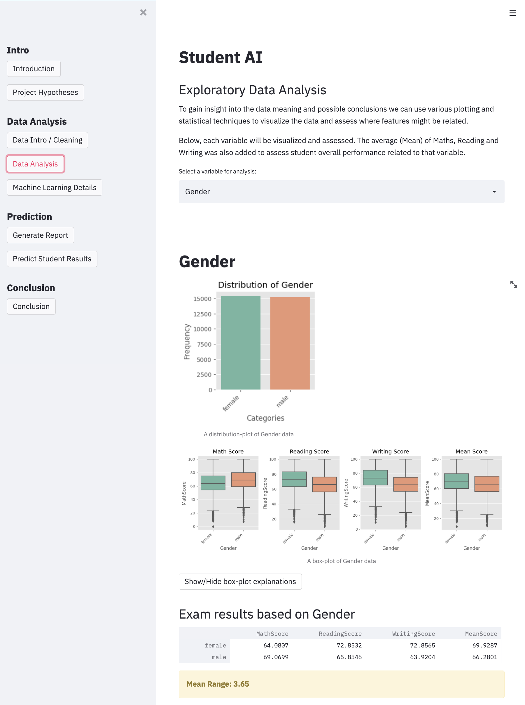

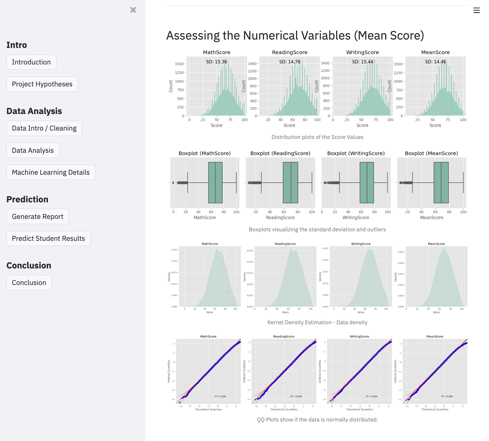

#### Page 5 - Machine Learning Details
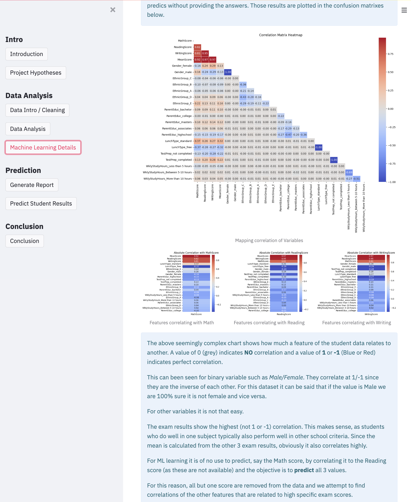

#### Page 6 - Generate Report Page
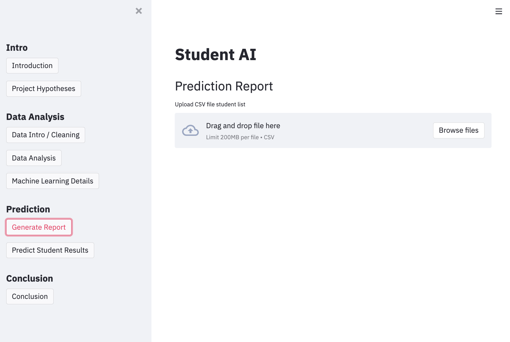
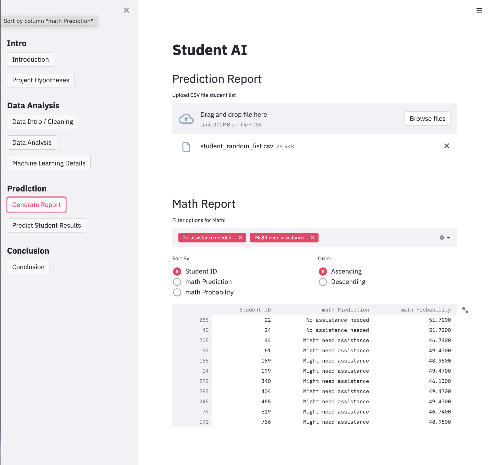

#### Page 7 - Student Prediction Page
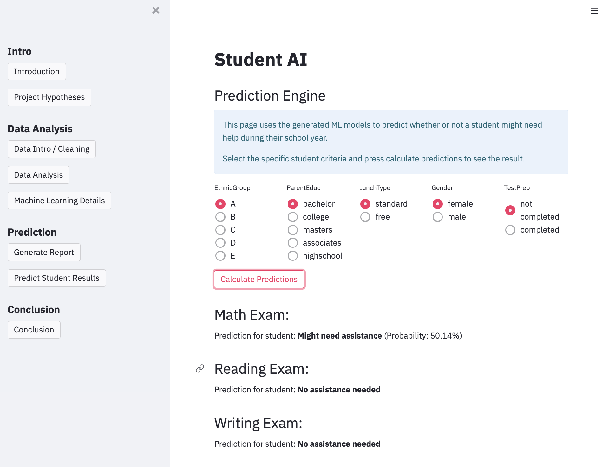

#### Page 8 - Conclusions
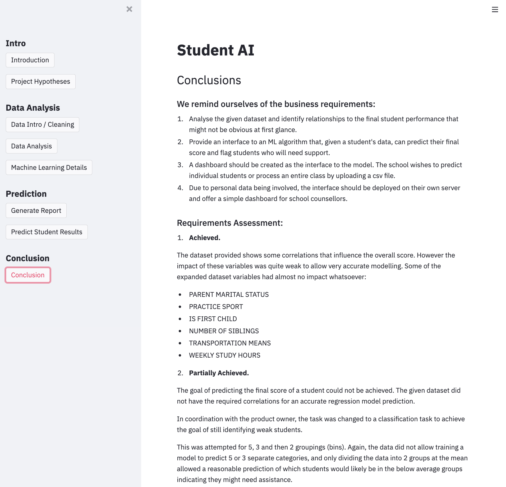

## Testing
The project is build iteratively and as such tested continuoulsy as it it built.

All python only files were passed through CodeInstitue [Pep8 Python linter.](https://pep8ci.herokuapp.com/) 
All linting errors were fixed and all files return no issues. (Applies to all app pages, as well as ML custom function files)

### Specific Manual Testing for Deployed app
#### Jupyter Notebooks
|Action/Story|Action|Result|
|:---|:---|:---|
|Notebooks general, packages|ensure all requirements are installed|no warning errors when importing|
|Notebook1 - Load data|Connect to Kaggle to download dataset with API|Downloads correctly|
|Notebook1 - Display Data|Run all cells and check dataset|Dislpays as expected|
|Notebook2 - all cells run|Reset and Clear Outputs click RUN ALL|All cells run as expected|
|Notebook3 - all cells run|Reset and Clear Outputs click RUN ALL|All cells run as expected|
|Notebook3 - individual charts correct|check each variable is correctly plotted|All plots are correct|
|Notebook3 - individual charts saved in correct location|delete files, run NB|All plots are generated and saved|
|Notebook3 - individual text files saved in correct location|delete files, run NB|All text files are generated and saved|
|Notebook4 - all cells run|Reset and Clear Outputs click RUN ALL|All cells run as expected|
|Notebook4 - individual charts correct|check chart correctly plotted|All plots are correct|
|Notebook4 - individual charts saved in correct location|delete files, run NB|All plots are generated and saved|
|Notebook5 - all cells run|Reset and Clear Outputs click RUN ALL|All cells run as expected|
|Notebook5 - interactive charts|manipulate charts and check they work|work as expected|
|Notebook5 - interactive charts saved as HTML|delete html files and run cells|charts generated and saved as expected|
|Notebook6 - all cells run|Reset and Clear Outputs click RUN ALL|All cells run as expected|
|Notebook7 - all cells run|Reset and Clear Outputs click RUN ALL|All cells run as expected|
|Notebook8a - all cells run|Reset and Clear Outputs click RUN ALL|All cells run as expected|
|Notebook8b - all cells run|Reset and Clear Outputs click RUN ALL|All cells run as expected|
|Notebook8c - all cells run|Reset and Clear Outputs click RUN ALL|All cells run as expected|
|Notebook9a - all cells run|Reset and Clear Outputs click RUN ALL|All cells run as expected|
|Notebook9a - models saved|delete model and rerun NB|model saved with correct version folder v1,v2 etc|
|Notebook9b - all cells run|Reset and Clear Outputs click RUN ALL|All cells run as expected|
|Notebook9b - models saved|delete model and rerun NB|model saved with correct version folder v1,v2 etc|
|Notebook9c - all cells run|Reset and Clear Outputs click RUN ALL|All cells run as expected|
|Notebook9c - models saved|delete model and rerun NB|model saved with correct version folder v1,v2 etc|
|Notebook10 - all cells run|Reset and Clear Outputs click RUN ALL|All cells run as expected|

#### Streamlit Dashboard
|Action/Story|Action|Result|
|:---|:---|:---|
|App Displays|Start app in console for local machine|app loads correctly in browser|
|Menu Buttons work|Click all menu buttons|correct page is loaded|
|Intro Page|Display correcetly, links work|shown as expected|
|Project hypotheses Page|Page load and displays correct content|as expected|
|Data Intro Page|select page|all dataframes rendered correctly|
|Data Intro Page|select page|all images rendered correctly|
|Data Intro Page|select page|all tables rendered correctly|
|Data Analysis Page loads correct|select page|displays correctly|
|Data Analysis Page interactive buttons|Click all buttons/dropdowns|work as expected|
|Data Analysis Page variable data correct|Select all variables|Data loads and displays correcet info|
|Data Analysis Page Interactive Charts Display Correctly|click elements on chart|Behaves as exepcted & responsive|
|Machine Learning Page loads correct|select page|all elements visible as expected|
|Machine Learning Page confusion matrices|select all buttons|data loaded correctly for each variable|
|Generate report page displays|select page|loads correctly|
|Generate report page upload file|drag and drop student csv file|loads as expected and report is generated|
|Generate report page upload bad file|drag and drop wrong student csv file|file is rejected as expected|
|Generate report page reports|upload file|3 reports generated as expected|
|Generate report page filters|select all filters|data is filtered as expected on all 3 reports|
|Generate report page sorting|click all sort options and ascending / descending| works as expected for all 3|
|Predict Student Results page|Click on Page|page loads and correct buttons are shown|
|Predict Student Results predict button|click button|prediction is displayed as expected|
|Predict Student Results predictions|click all radio button combos|new prediction generated and chages acc to model|
|Conclusion Page loads|click on page button|displays as expected|

## Unfixed Bugs
no known bugs remain.
 
## Deployment
### Heroku

* The App live link is: https://student-ai-f1a195bb5d91.herokuapp.com/
* Set the runtime.txt Python version to a [Heroku-20](https://devcenter.heroku.com/articles/python-support#supported-runtimes) stack currently supported version.
* The project was deployed to Heroku using the following steps.

1. Log in to Heroku and create an App
2. At the Deploy tab, select GitHub as the deployment method.
3. Select your repository name and click Search. Once it is found, click Connect.
4. Select the branch you want to deploy, then click Deploy Branch.
5. The deployment process should happen smoothly if all deployment files are fully functional. Click now the button Open App on the top of the page to access your App.
6. If the slug size is too large then add large files not required for the app to the .slugignore file.

## Main Data Analysis and Machine Learning Libraries
### Libraries and Packages

- [NumPy](https://numpy.org/) was used for basic mathematical operations such as standard deviations and mean values

- [Pandas](https://pandas.pydata.org/) was used for many operations:
    - Loading CSV files into Series and Dataframes
    - Saving Series and Dataframes as CSV, txt and HTTP files
    - Creating and modifying Series and Dataframes
    - The correlation method for conduction the correlation study

- [MatPlotLib](https://matplotlib.org/) and [Seaborn](https://seaborn.pydata.org/) were used for constructing plots to visualise my data analyses, in particular countplots and barplots

- [Plotly](https://plotly.com/python/) was used for constructing interactive plots for both the notebooks as well as embedding in the dashboard for more interactivity

- [Feature Engine](https://feature-engine.readthedocs.io/en/1.1.x/) was used for machine learning tasks:
    - The OrdinalEncoder allows the categorial data to be converted to numbers befor eit can be passed to an ML regression or classification task.
    - The EqualFrequencyDiscretiser and ArbitraryDiscretiser modules allowed the numerical variables to be equally distributed into 'bins' to allow a classification task.
    - The OneHotEncoder allows the dataset to be transformed for a correlation study
  
- [SciKit Learn](https://scikit-learn.org/stable/) was used for machine learning tasks:
    - Provided the various algorithms used to train the regression and classification model
    - Pipeline for building machine learning pipelines
    - SelectFromModel for feature selection steps in the pipelines
    - Train-Test Split for creating train and test sets
    - Make Scorer and Recall Score for assessing algorithm and hyperparameter performance
    - Classification Report and Confusion Matrix for constructing classification reports and confusion matrices for assessing model performance

- [XGBBoost](https://xgboost.readthedocs.io/en/latest/index.html) provided the XGBoost Regressor and XGBoost Classifier algorithms

- [Pinguoin](https://pingouin-stats.org/api.html) was used for the Shapiro-Wilk test for normal distribution

- [Predictive Power Score](https://github.com/8080labs/ppscore) was used for conducting a Predictive Power Score analysis

### Resources

The following resources were used to assist in the construction of this project:

- The dataset used in this project is located [here](https://www.kaggle.com/datasets/desalegngeb/students-exam-scores).

- My CodeInstitute walkthrough project [(Churnometer)](https://github.com/A-Hoenig/churnometer) was the baseline for this project.  
The project provided many custom functions that automated much of the model and hyperparameter selection and evaluation. I modified them to be more universally usable and centrally available. The main ones were:
    - The HyperparameterOptimizationSearch class, for testing several algorithms and their hyperparameters
    - The custom functions for generating lassification reports and a confusion matrices (I modified this one to output markdown formatted text which could be directly embedded in the streamlit dashboard)
    - Custom Function for feature importance listing

- Additionally the Project Walkthrough provided a basic and generic template for the streamlit multipage app that allowed the deployed app to be generated relatively quickly. I modifed it quite a bit to be more interactive and dynamic. The project is automated to the point where the jupyter notebooks generate charts, dataframes, models and text automatically and share directly with the streamlit app. (on the local machine) - that way any changes to the ML pipeline or updates to the model are immediately available for testing in the local streamlit front end, and can then be committed to the deployed app on Heroku.

## Credits 

- PP5 project by Adam Boley [(here)](https://github.com/AdamBoley/Exam-Scores-Analysis/) helped me greatly in understanding the theoretical principles again after the course content was completed.

## Acknowledgements (optional)
- Thanks to my mentor Precious Ijege for some valuable insights into the state of my project and real world applications. Thanks!

